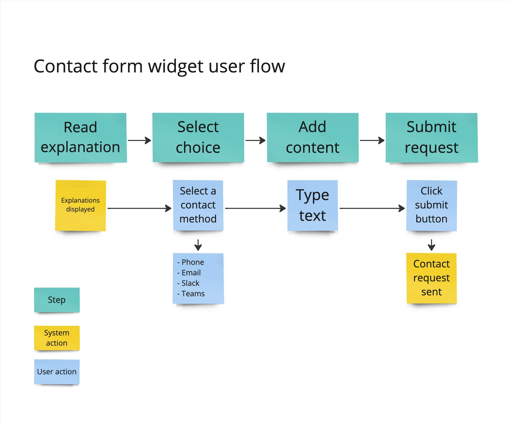
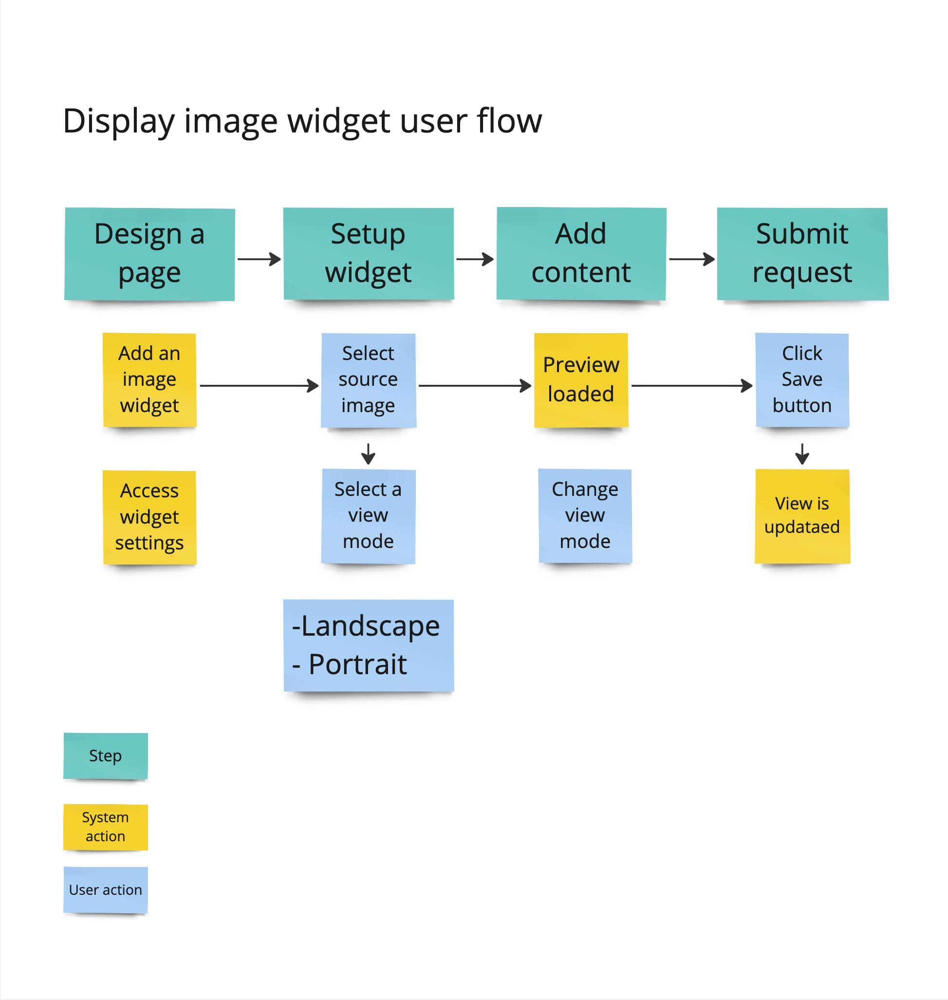

# Design documentation

**The LumApps partner’s documentation is a guide designed to help partners create their own extensions. Its goal is to assist designers, developers, and project managers in building extensions that perfectly fit in the LumApps environment.**

**This documentation contains a methodology with examples and best practices. It also contains instructions on how to use at its best the LumApps Design System for your projects.**

## Introduction

### Lumapps layout

A LumApps platform is composed of one or more sites. A site is made up of different elements including pieces of content which are built with <strong>widgets</strong>, <strong>cells</strong> and<strong> rows</strong>

Coucou In LumApps, a piece of content relies on a web-grid format. This grid is created with both rows and cells that are customizable: you can change the spacing, the borders, the background, etc. There is no limitation on the number of rows, and there is a maximum of four cells inside a row. LumApps’ content uses a web-grid to help you build a page. The grid is based on rows and cells where you can customize their spacing, borders, and background directly in the product.

A LumApps page can be composed of an infinite number of rows. Cells populate rows. A maximum of four cells can be added into a row.

### Widgets

Coucou Widgets are elements displaying specific information and communication within a piece of content. They are added inside cells and their width depends on the width of the cell width containing the widget. A cell can contain multiple widgets.

A widget has three parts: a <strong>header</strong>, a <strong>body</strong> and a <strong>footer</strong>

The header and footer are optional. The header can be used to display a title and an icon. The footer can be used to display a link and an icon. The body contains the core of the widget such as information and interaction items.

Widgets also have styles that impact color, typography, spacing, etc. There is a default widget style, but a widget can also have a custom style. This custom style can be reused.

## Building a user experience

The aim of this section is to help you understand how to design the user experience and the user interface of your extension project.

### Defining user needs

The first thing to consider before creating your extension is to make sure you understand the user needs. It is important to design an experience that is going to be useful. To do so, answering a few questions helps to understand your users and discover their needs:

-   Who will use the widget?
-   Why would they use it?
-   When will they use it?
-   What do users need to use it?

From those answers, you can shape personas. Personas are fictional characters that represent the different user types who might use your extension. By reviewing your persona’s goals and needs, you can then try to determine what could be the different use cases of the extension. Make an exhaustive list of all possible use cases, then define which ones have the highest values for the users.

Once you have the main use cases, you can better decide what needs to be displayed in the widget body.

    <strong> Best Practice </strong>
    

        In your list of personas don't miss the contributor. This user is important because s·he will pick and configure
        your widget in the page or template.
    

### Create a user flow

User flows are diagrams that display the complete path a user takes when using a feature. The user flow maps out every step, human and machine interactions, from the entry point to the final interaction.

[Draw.io](https://www.draw.io/) is an example of a helpful tool that helps shape a user flow.

#### Steps

Creating a user flow requires first to imagine how the main use case is addressed by the extension. Split the path into the different steps a user needs to perform to complete the use case.
Quick and easy processes always deliver a better user experience. You may have to try different paths to find the best possible solution.

    

        <strong>Example</strong>
        
For a survey widget, the user has to go through four different steps:

        <ol>
            <li>Read information to get context,</li>
            <li>Pick a choice amongst different propositions,</li>
            <li>Submit their choice,</li>
            <li>Receive a confirmation that their choice has been taken into account.</li>
        </ol>
    

    

#### Interactions

For each step, imagine what interactions the user can or could perform and try to think of all the information that is displayed to the user.

Interactions can go from the user to the system and from the system to the user.

-   **User input** is requested by the system to address the use case. You can now imagine how the user will
    interact with the interface to give information.

    

        <strong>Example</strong>
        

            A registration form asks the user to provide a way of contact. The user must select a way of contact amongst
            a list of choices (phone, email, chat…), then they need to type in their personal information.
        

    

    

-   **System tasks** can be triggered by the user. Imagine how the users will interact with the system and describe
    how the system will respond.

    

        <strong>Example</strong>
        

            A widget displays images. When writing a content, the contributor can choose between three different
            possible previews: landscape, portrait, and square. The user must define their preference in the widget
            settings.
        

    

    

#### Information

The system can display information to the user such as media, text, in a more or less structured information.

    

        <strong>Example</strong>
        
A widget shows a list of users having their birthday today.

    

    

As you need to cover all the main use cases, you should have pretty detailed user flows which gives you a good overview of how users will use your extension.

**“But how to deliver a great user experience?”**

As you get an idea of what is the user experience on your widget, you may wonder how to get the best user experience for your widget.

1. Re-read carefully the list of user needs and make sure they are fully addressed.

2. Put yourself in your user’s shoes.

3. Put the personas in parallel with users' flows and ask yourself if the user will go through it without any issue.

4. Try to optimize the flow by getting rid of unnecessary steps and interactions.

### User Interface components

LumApps has its own design system, it provides UI components usable by extension creators. A design consistency improves the overall usability of the product.

As you take a look at user interactions defined in your user flows, browse them and try to find elements that would be useful to build the experience you imagined.

Browse [LumApps' design system](/) and identify components that would allow users interactions and display information the best way possible.

#### User input

User inputs enable users to fill in information, to define preferences. User inputs are generally used in forms. Components should provide users a way to correctly add requested information.

    

        <strong>Example</strong>
        

            In a survey widget, the user must choose between three options. Radio button components are appropriate as
            it displays all options and restrain users in selecting only one choice.
        

    

    

A list of possible components:

-   [Autocomplete](/product/components/autocomplete/)
-   [Checkbox](/product/components/checkbox/)
-   [Date picker](/product/components/date-picker/)
-   [Radio button](/product/components/radio-button/)
-   [Select](/product/components/select/)
-   [Slider](/product/components/slider/)
-   [Text field](/product/components/text-field/)
-   [Uploader](/product/components/uploader/)

    <strong>Best practice</strong>
    

        Component’s labels, placeholder, and helpers should be clear enough and adapted to the level of understanding of
        your audience.
    

#### Interaction with the system

Users can interact with the system through multiple components. Some components enable users to do very simple actions while others provide users the ability to perform complex tasks.

**Simple interactions** require only a click to be triggered. It allows to define a preference
or to validate:

-   [Switch](/product/components/switch/)
-   [Buttons](/product/components/button/)
-   [Link](/product/components/link/)
-   [Tabs](/product/components/tabs/)
-   [Link preview](/product/components/link-preview/)

**Advanced interactions** that enables detailed position:

-   [Slider](/product/components/slider/)

**Interactions feedback** inform users and interaction is in progress or has been completed successfully or
unsuccessfully:

-   [Notification](/product/components/notification/)
-   [Progress](/product/components/progress/)
-   [Progress tracker](/product/components/progress-tracker/)
-   [Skeleton](/product/components/skeleton/)

#### Display information

Components that present media, simple and advanced information.

**Media**
Display medias, images and videos

-   [Avatar](/product/components/avatar/)
-   [Image-block](/product/components/image-block/)
-   [Lightbox](/product/components/lightbox/)
-   [Thumbnail](/product/components/thumbnail)
-   [Thumbnail mosaic](/product/components/mosaic/)
-   [Slideshow](/product/components/slideshow/)

**Simple information.**
Simple text based information

-   [Notification](/product/components/notification/)
-   [Popover](/product/components/popover/)
-   [Tooltip](/product/components/tooltip/)

**Advanced information.**
Display structured and or complex information such as rich text or structured information

-   [Table](/product/components/table)
-   [Comment block](/product/components/comment-block/)
-   [User block](/product/components/user-block/)
-   [Dialog](/product/components/dialog/)

#### Structure interfaces

Creating a structured interface requires assembling all the UI components in a logical and effective way to make the user flow all along the way. A great user experience is achieved when users reach their goal without issues or hesitations.

    

        <strong>Example</strong>
        

            In a form widget, the user is supposed to fill-in a text field. Help the user fill the form quickly by
            giving a clue on what is expected in the text fields. Placeholders specify a short hint that describes the
            expected value of an input field.
        

    

    

**Dialogs**

Your widget generally contains all your UI components. However, to get rid of space limitations due to the widget framing, you can decide that the user accesses a dialog to do interactions and get information. Dialog is displayed over the screen and enables users to focus.

    

        <strong>Example</strong>
        

            To refuse a request, the user must write a comment. From the widget, a dialog is displayed when the user
            clicks on the refuse button. The dialog enables the user to focus on the task they have to complete.
        

    

    

    <strong>Best Practice</strong>
    
Use dialogs when the user needs to execute complex tasks, or be aware of important information.

Inside a dialog, [tabs](/product/components/tabs/) enable structured information and interactions. The user clicks on tabs to access another section.

Stepper dialog is a container used in the case of a creation process. A [progress tracker](/product/components/progress-tracker/) conveys user progress through a sequence of steps. Each step of the process can contain multiple UI components.

    

        <strong>Example</strong>
        

            A stepper dialog enables the user to create a new request, and the user must complete four steps to create
            and send their request. Each step is composed of text fields.
        

    

    

    <strong>Best Practice</strong>
    
Stepper dialog should be used for complex creation with multiple possibilities and settings.

A [toolbar](/product/components/toolbar/) displays information and actions related to the context.

    

        <strong>Example</strong>
        
A toolbar with a search field and filter can be very useful for widgets listing lots of users

    

    

Information can be structured inside a container by creating sections. They are separated by [divider](/product/components/divider/). Each section has a subtitle, and can also embed a subsection.

[Expansion panel](/product/components/expansion-panel/) uses the principle of progressive disclosure to implement large amounts of content in a small space through progressive disclosure.

#### Test and iterate

Once you are done with designing and developing, your extension widget is not ready yet for the deployment phase. You need to make sure your extension widget has reached a high quality standard first.

**Quality assurance**

Take the role of an end user and use your widget. The Playground is a local application that enables you to preview your widget and test every possible use case to try to identify bugs and errors.

**Usability testing**

Put your extension widget in the hands of an end user and ask them what they think about it. The usability test can reveal the strengths and weaknesses of your project. Insights learned from test sessions enable you to operate iteration to improve your extension widget.

    <strong>Best Practice</strong>
    
Conducting test sessions with five different users help detect 90% of the problems within your project.

A lot of different methodologies exist to run a usability test. There is no right or wrong methodology, use the one that fits with your constraints.

Some usability test methodologies:

-   [Guerilla testing](https://maze.co/guides/usability-testing/guerrilla/)
-   Lab usability testing
-   Unmoderated remote testing
-   [Card sorting](https://maze.co/guides/ux-research/card-sorting/)
-   Phone interview
-   A/B testing
