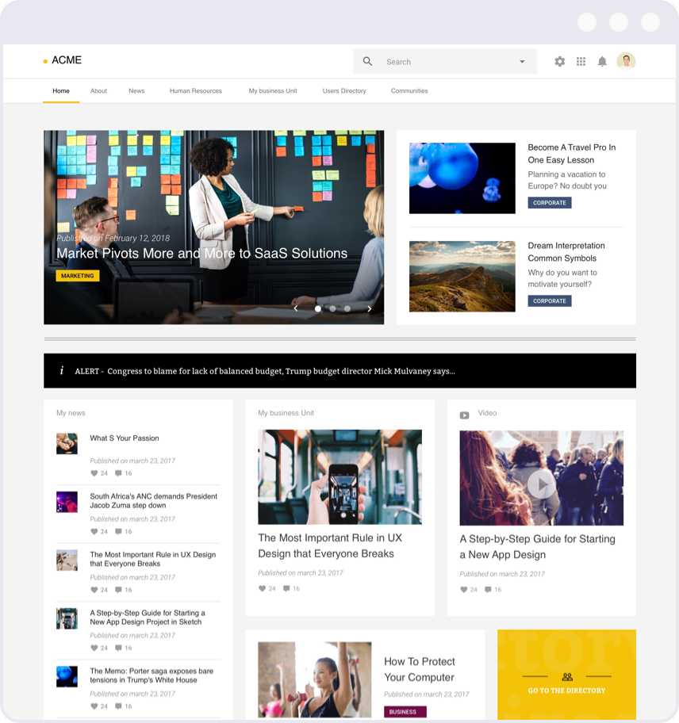

import { AssetBlock } from '@lumx/demo/layout/AssetBlock';
import { Alignment, Grid, GridItem, Orientation, Size, Thumbnail } from '@lumx/react';

# Site templates

**Want to customize LumApps to your Brand visual identity but don’t know where to start?
Here are some templates to bootstrap your work.**

## How to

  

  Our templates are made with <a href="http://www.sketch.com" target="_blank">Sketch</a>, currently one of the best UI tools. Chose the template that best suits your needs and modify it.

<Grid
    orientation={Orientation.horizontal}
    wrap={'wrap'}
    vAlign={Alignment.center}
    hAlign={Alignment.top}
    gutter={Size.huge}
>
    <GridItem width="6" className="lumx-spacing-margin-bottom-huge">
        <a href="#business-services">
            <Thumbnail image="assets/template1.png" />
        </a>
    </GridItem>
    <GridItem width="6" className="lumx-spacing-margin-bottom-huge">
        <a href="#technology">
            <Thumbnail image="assets/template2.png" />
        </a>
    </GridItem>
    <GridItem width="6" className="lumx-spacing-margin-bottom-huge">
        <a href="#editorial">
            <Thumbnail image="assets/template3.png" />
        </a>
    </GridItem>
    <GridItem width="6" className="lumx-spacing-margin-bottom-huge">
        <a href="#blue">
            <Thumbnail image="assets/template4.png" />
        </a>
    </GridItem>
</Grid>

## Business services <a name="business-services"/>

<AssetBlock downloadURL="assets/lumapps-template-business-services.sketch">
  
</AssetBlock>

## Technology <a name="technology"/>

<AssetBlock downloadURL="assets/lumapps-template-technology.sketch">
  
</AssetBlock>

## Editorial <a name="editorial"/>

<AssetBlock downloadURL="assets/lumapps-template-editorial.sketch">
  
</AssetBlock>

## Blue <a name="blue"/>

<AssetBlock downloadURL="assets/lumapps-template-blue.sketch">
  
</AssetBlock>
