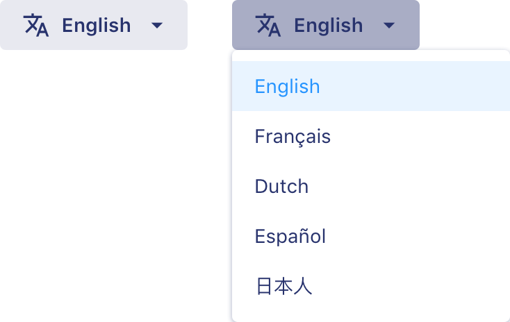
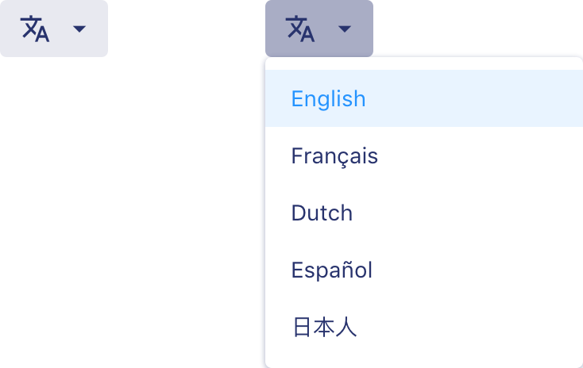

# Language switcher

**Language switchers display language options in a list and present the option the user chose. Use it when users need to select a language.**

Language switchers exist in two variants: _default_ and _compact_

## Default

<DemoBlock withThemeSwitcher>
    

        
    

</DemoBlock>

## Compact

<DemoBlock withThemeSwitcher>
    

        
    

</DemoBlock>

### Properties

<PropTable component="" />
