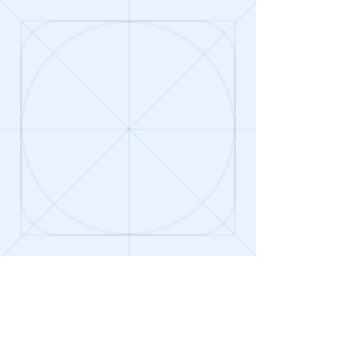

import { FlexBox } from '@lumx/react';
import { IconLibrary } from '@lumx/demo/components/content/design-tokens';
import * as Demo1 from './react/demo1.tsx';

# Iconography

**Icons are small visual representations of common actions, objects or ideas. They help users to identify information and provide context.**

## Sizes

Icons come in 6 sizes: `xxs`, `xs`, `s`, `m`, `l`, `xl`.

<DemoBlock orientation="horizontal" demo={{ react: Demo1 }} />

## Layout

We use [Material Design](https://material.io/archive/guidelines/style/icons.html) grid and proportions.

<FlexBox orientation="horizontal">
    
    
</FlexBox>

## Library

Our `@lumx/icons` icon library is based of the MDI v5 with some re-compatibility with MDI v4 and some of our own icons.

<IconLibrary />
