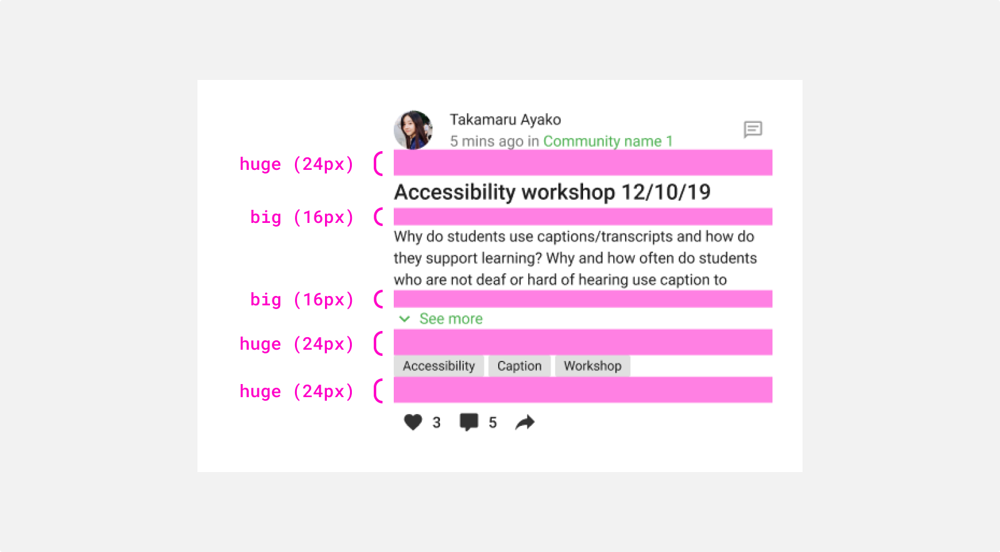

# Spacing

**Use the spacing scale when building individual components (i.e. the space between a label and a text input) and for arranging components and other UI parts into a full page layout (i.e., the space between a text field and a selector). This scale is applied and used within all components with [tokens](/product/design-tokens/spacing) and [utilities](/product/utilities/spacing).**

## Spacing scale

<table style={{ textAlign: 'left', width: '100%' }}>
    <thead>
        <tr>
            <th>Name</th>
            <th>Value</th>
            <th>Example</th>
        </tr>
    </thead>
    <tbody>
        <tr>
            <td>
                <strong>tiny</strong>
            </td>
            <td>4dp</td>
            <td>
                

            </td>
        </tr>
        <tr>
            <td>
                <strong>regular</strong>
            </td>
            <td>8dp</td>
            <td>
                

            </td>
        </tr>
        <tr>
            <td>
                <strong>big</strong>
            </td>
            <td>16dp</td>
            <td>
                

            </td>
        </tr>
        <tr>
            <td>
                <strong>huge</strong>
            </td>
            <td>24dp</td>
            <td>
                

            </td>
        </tr>
    </tbody>
</table>

## Applying spacing

Example of spacing applied to a component.

