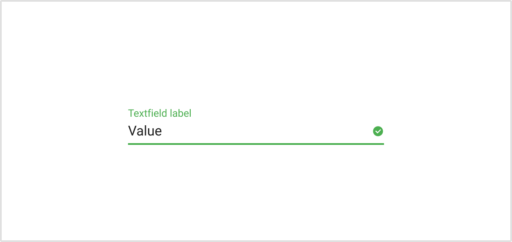

import { Text } from '@lumx/react';

# Form validation

**Use form validations to give feedbacks about invalid users inputs and reduce risks of confusion.**

Validation requirements **must be stated upfront**, live feedbacks are strongly suggested. Users mustn't be left guessing.

A validation can occur for example when:

-   The datatype isn’t correct.
-   The entered data has too many or not enough characters.
-   No data has been entered in a required field.

## Visualization

Colors scheme :

-   <Text as="span" color="red-N" typography="subtitle1">Red/N</Text> for errors
-   <Text as="span" color="yellow-D2" typography="subtitle1">Yellow/D2</Text> for warnings
-   <Text as="span" color="green-N" typography="subtitle1">Green/N</Text> for success
-   <Text as="span" color="dark-N" typography="subtitle1">Dark/N</Text> for helpers

## Error state

Use error messages to help users understand the issue and how to fix it. Error messages are emphasized with :

-   The label in <Text as="span" color="red-N" typography="subtitle1">Red/N</Text>
-   The field borders in <Text as="span" color="red-N" typography="subtitle1">Red/N</Text>
-   The material design icon “alert-circle” within the field in <Text as="span" color="red-N" typography="subtitle1">Red/N</Text>
-   The error message in <Text as="span" color="red-N" typography="subtitle1">Red/N</Text>, under the field

## Success state

Use success messages to confirm users inputs validation. Success messages are not mandatory.
Success messages are emphasized with :

-   The label in <Text as="span" color="green-N" typography="subtitle1">Green/N</Text>
-   The field borders in <Text as="span" color="green-N" typography="subtitle1">Green/N</Text>
-   The material design icon “check-circle” within the field in <Text as="span" color="green-N" typography="subtitle1">Green/N</Text>

## Helpers

Use helper messages to provide guidance. \
Helper messages are not mandatory. \
Helper messages are emphasized with the helper message in <Text as="span" color="dark-L2" typography="subtitle1">Dark/L2/N</Text>, under the field.

## Submit button behavior

By default, the submit button is disabled as long as the mandatory fields haven’t been completed, or present errors.

The submit button is enabled when all the mandatory fields have been completed, and do not present errors.

## Validation feedback

The validation feedback should be triggered when the user has clicked away from the text field, and only if the user has ever typed something in the field.

## Inline validation

**Error occurring in a particular field**

Error messages must be displayed inline with erroneous fields. If an error occur in a particular field, show it under this field.

## Stepper buttons behavior

The "Next" stepper button is _disabled_ as long as the mandatory fields haven’t been completed or present errors.

The "Next" stepper button is _enabled_ when all the mandatory fields have been completed and do not present errors.

## Optional vs. mandatory fields

Mandatory fields are marked with a red asterisk at the beginning of the label.

## Error message copy

The error message copy below the field should be as informative as possible when describing the issue with the users data. Error messages should clearly state:

-   What happened, ex. : \
    <Text as="span" color="red-N">Sorry, this username has already been taken</Text>
-   What’s the next step the user should take to succeed, ex. : \
    <Text as="span" color="red-N">Please choose another username</Text>

Validation labels should always avoid using technical jargon.

## Submit error state

If the error is general (e.g. a problem with sending data to the server) and there wasn’t a page reload – show the message next to the submit button, if there was a page reload – show it at the top of the page.
