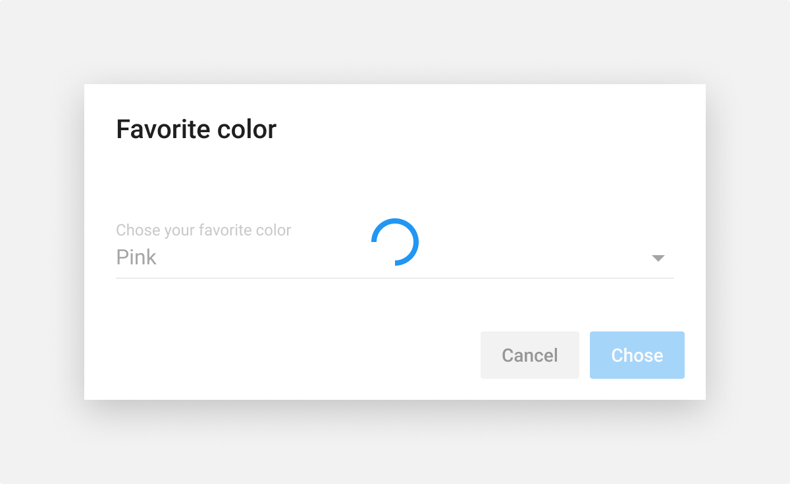
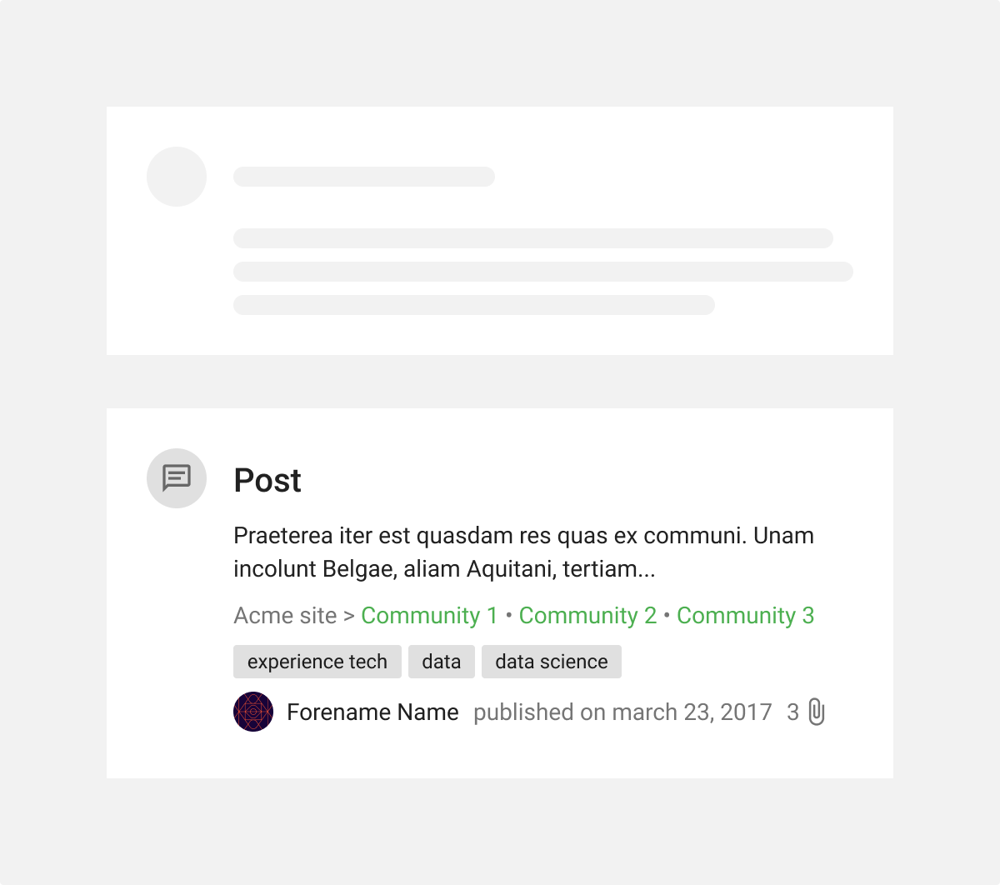
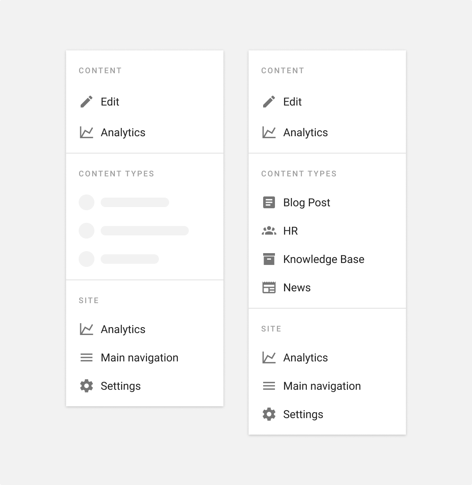

# Loading state

**Use loading states when information takes an extended amount of time to process and appear on-screen. [Progress](/product/components/progress) and [Skeleton](/product/components/skeleton) components communicate loading states.**

Loading states use motion to convey that the application is in transition phase and not stuck. This can help reduce user uncertainty.

There are two ways of communicating loading state, both consist in displaying animated components.

Use `progress` most of the time as it is relatively straightforward in design and development.

Use `skeleton` for pieces of UI which loading require a special treatment: people see them loading a lot of time during their journey on the app, they are the first elements to render when loading the app and so on.

## Progress

Using [progress](/product/components/progress) is the simplest way of communicating that an action is being completed.

Use progress in place of content while loading.

Use progress in combination with dimming overlays and disabled inputs when users action need time to process, like submitting a form.

Prefer `circular` over `linear` **progress** variant, linear are only used in rare cases like page loading or some widgets loading.

## Skeleton

Using [skeleton](/product/components/skeleton) is an advanced way of communicating that an action is being completed.

When designing loading states with skeleton, use the minimum elaboration needed to make the replaced content recognizable. Not all components need to be replaced by shapes.

The number of successive similar pieces of content doesn’t have to be exact and should not exceed 3 if it’s not crucial to make the content recognizable.

Add some variation on successive similar pieces of content to increase skeleton similitude with the replaced content.

Consider the following components when designing loading states with skeleton:
• Container-based components (avatars, tiles, list, and so on)
• Data-based components which pull in data (tables)
• Data indicators (badges)
• Data-based text
