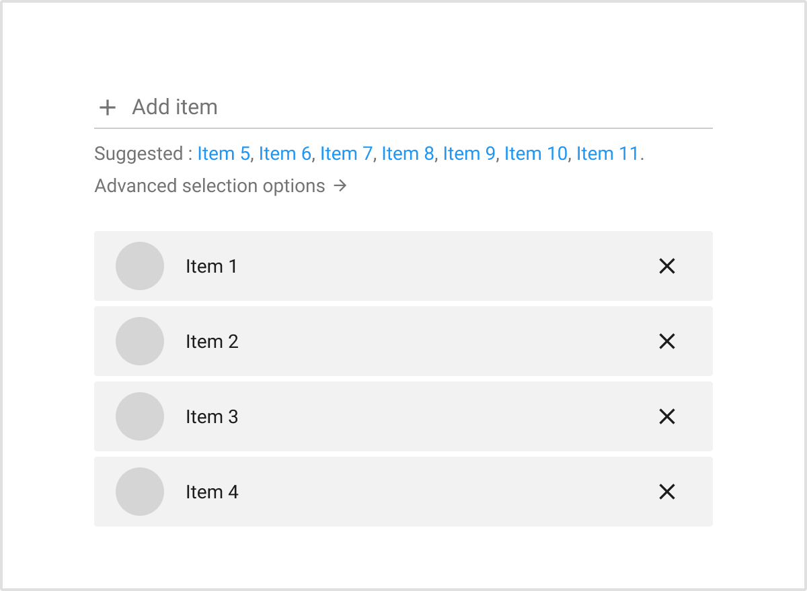
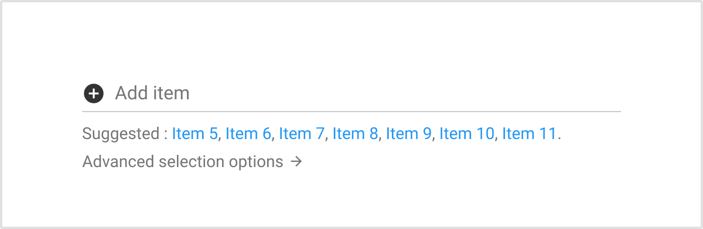

# Pick and manage

**Use the pick and manage pattern whenever the need to pick items and manage them arises within the interfaces. The management of the picked items is made directly from the interfaces.**

This pattern includes the access to the picker and the management of the selected item, but does not include the selection of the items through a picker.

## Typology

### Overview

The pick and manage pattern is built with the following components: a title, a [button](/product/components/button) to access the picker, and one or several [list items](/product/components/list) or [expansion panels](/product/components/expansion-panel).

Both single and multi selection are possible.

### Multi selection

When used for the multiple selection, the button to access the picker stays enabled when items are already picked, and the label stays “Add [item]”.

Each expansion panel can have a drag handle.

### Single selection

When used for a single selection, the button’s label changes from “Add” to “Replace”. If the picked item is removed, the label goes back to “Add [item]”.

The drag handle is not needed in that case.

## Behavior

### Add method

The pick and manage pattern is built with a button to call a picker. This picker can be an advanced picker (i.e. user picker, content picker, etc.), or a simple picker (see “alternative method” below).

When the advanced picker is called, some picker’s settings can be deactivated (i.e. deactivate the deletion inside the picker to manage it only within the pick and manage pattern).

### Remove

Picked items can be removed with the “X” button.

### Empty state

When no items are picked, an empty state is used. This empty state displays an icon (not mandatory), the wording “There is no [item] added” and a button to open the picker.

### Expandable items

When more information are available or can be edited on an item, the expansion panel can be expandable (not mandatory).

### Drag and drop

When multiple selection is possible, a drag handle is displayed on each item to reorganise them.

## Alternative add method

### Autocomplete

When a picker is not the method used to pick items, the [autocomplete](/product/components/autocomplete) component is used to have a simpler picker. Its usage is suited when the item’s name is known by the user to avoid the advanced picker (i.e. user selection during the creation of a SA program, community picker).The autocomplete is displayed above the list of selected items.

## Empty state

When no items are picked within the simple picker, there is no empty state. The autocomplete component is displayed and empty.
