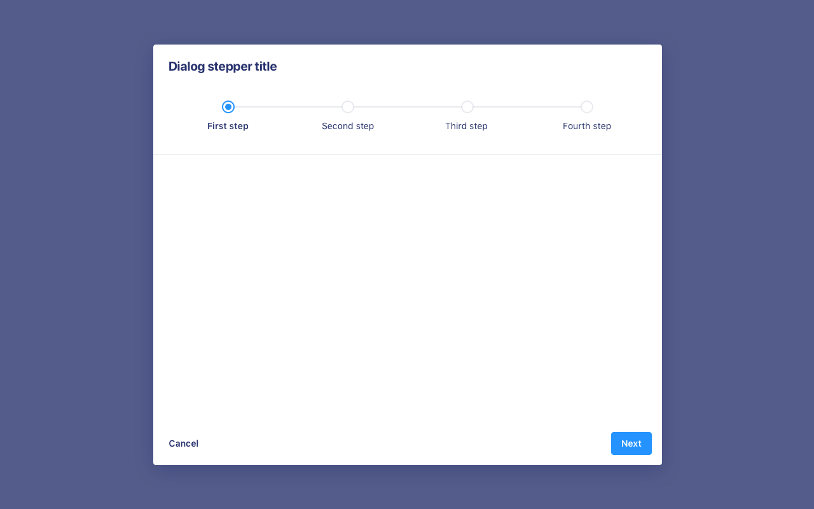
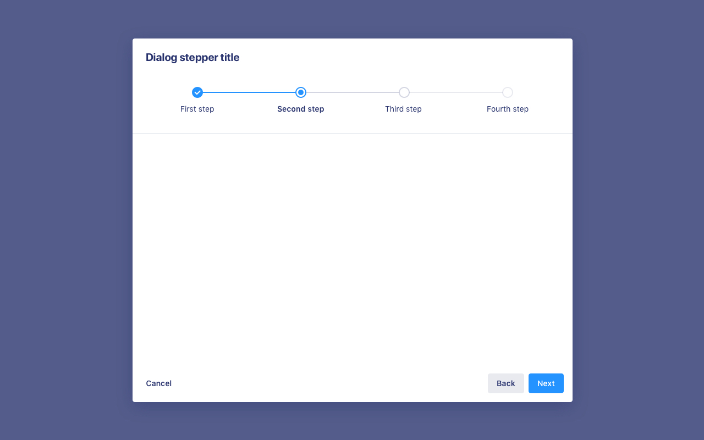
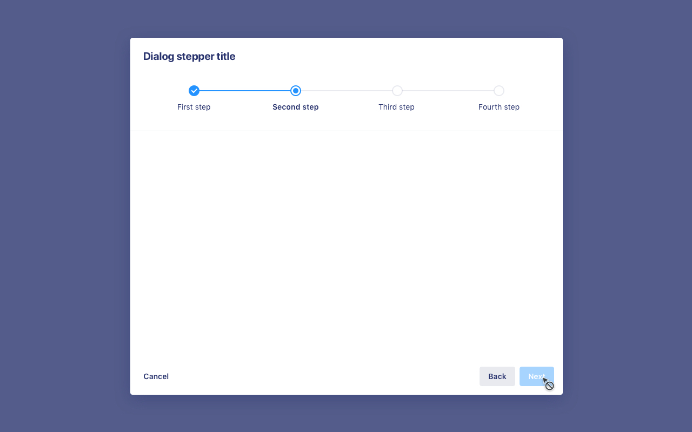
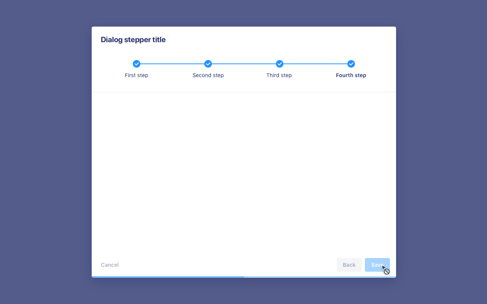
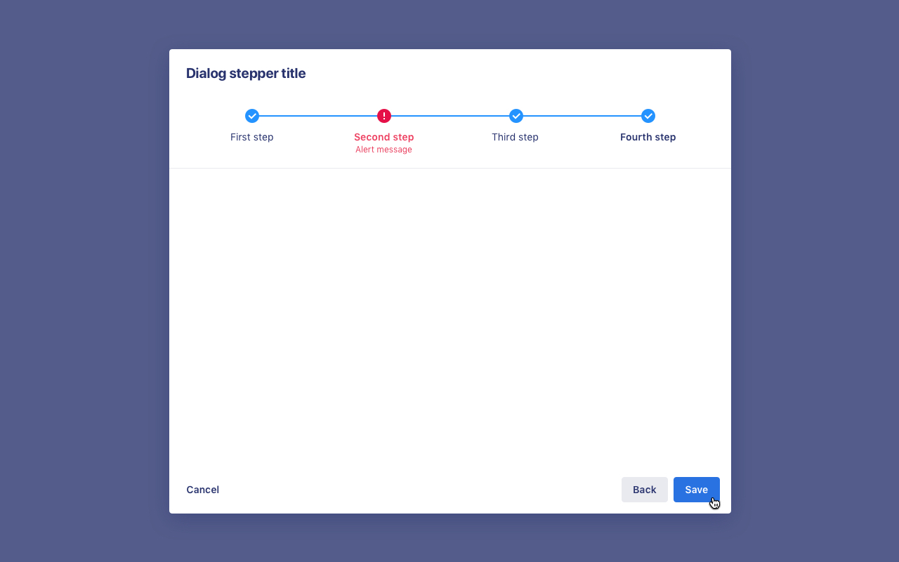
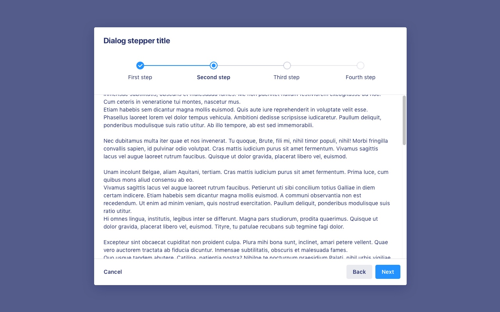

# Stepper dialog

**Stepper dialog conveys user progress through a sequence of steps within a dialog.**

Stepper dialog combines a [progress tracker component](/product/components/progress-tracker) and a [dialog](/product/components/dialog) component.

## First step

## Second step

## Final step

## Mandatory step

## Final step validation

## Final step with error state

## With scrollbar

When a Stepper dialog requires scrolling, the progress tracker stays at the top.

