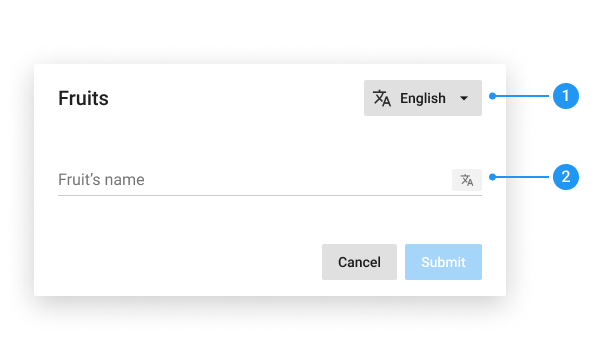
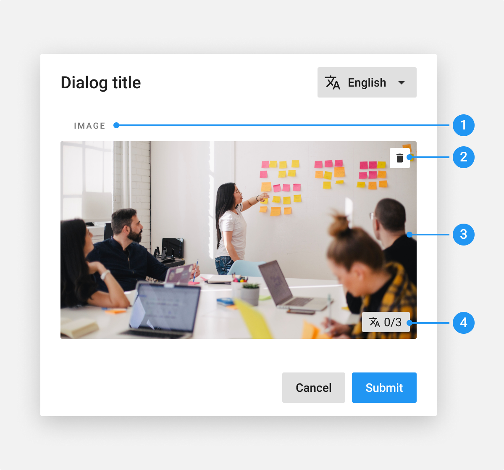

# Translation

**Use translation patterns when users need to provide data or values in two or more languages for the same form or piece of content. Translation patterns can be used in a [dialog](/product/components/dialog) or a page.**

## Translation in dialog

Dialogs with translatable content are made up of the following elements:         

1. **Language button**: Change the language of the whole dialog. The default language is the one of the user’s interface.

2. **Translation button**: Add translation for the each input.

### Empty

A translation button on an input indicates that it can receive translations. 
**As long as the field is empty, the button is disabled.**

### Filled

When an input is filled, the translation button is enabled, and indicates the number of languages available for the translation. 

The number doesn’t take in account the original language.

### Translate content

When clicking the **Translation button**, a dialog displays the following elements:

1. **Translation button**: the account changes according to the number of filled fields.

2. **Header**: the close buttons saves the translations.

3. **Translations field**: The placeholder is the name of the language to translate. There is as many field as languages to translate.

### Display modal in another language

The user can switch language ton display the whole content into the chosen language: 

1. **Language button**: When clicking the Language button, a dropdown menu is displayed with the list of the languages available. The whole list is displayed into the original language.

2. **Content**: all content is diplayed into the chosen language. Inside the Translation modal, the chosen language is no longer displayed.

3. **Empty field**: For a missing translation, display “No translation added”.

### Medias

As for text content, medias can be translated:

1. **Title**: Indicate the type of the media

2. **Delete media**

3. **Media preview**

4. **Translation button**

When clicking the **Translation button**, a modal is displayed with the following elements:

1. **Translation button**: the account changes according to the number of uploaded medias.

2. **Title**: indicates the language to translate.

3. **Uploader**: Each language have a specific uploader.