# Widgets settings pattern - Tab Contents

**All widgets share a common organization in terms of contents settings and style settings. This pattern focuses on the tab “Contents”.**

<i className="lumx-color-font-red-D2">
    Disclaimer: while the new DS is not implemented, some examples might seem incorrect due to various spacings included
    in some components.
</i>

## Anatomy

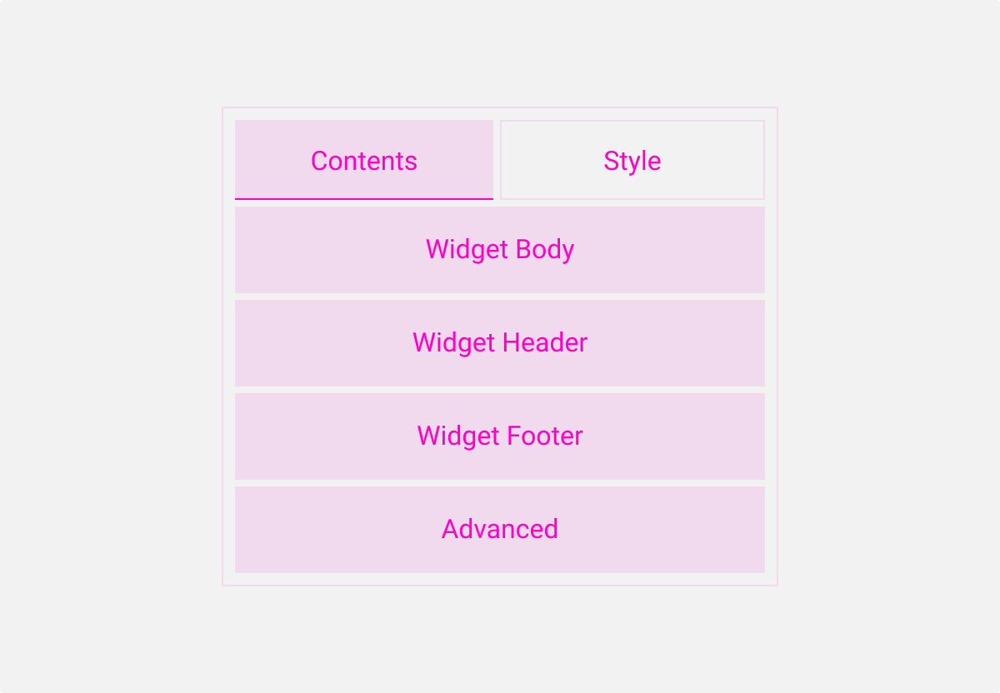

The “Contents” tab regroups all the settings linked to the items displayed by the widget. They answer the question **“What is displayed?”**.
The “Style” tab regroups all the settings that apply to the design of the widget. They answer the question **“How it is displayed?”**.

The “Contents” tab is divided into 4 sections: Widget Body, Widget Header, Widget Footer and Advanced.

## Heading and spacing rules

### The rule

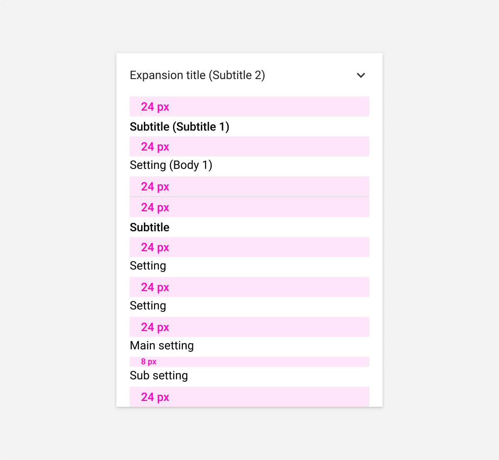

### Example

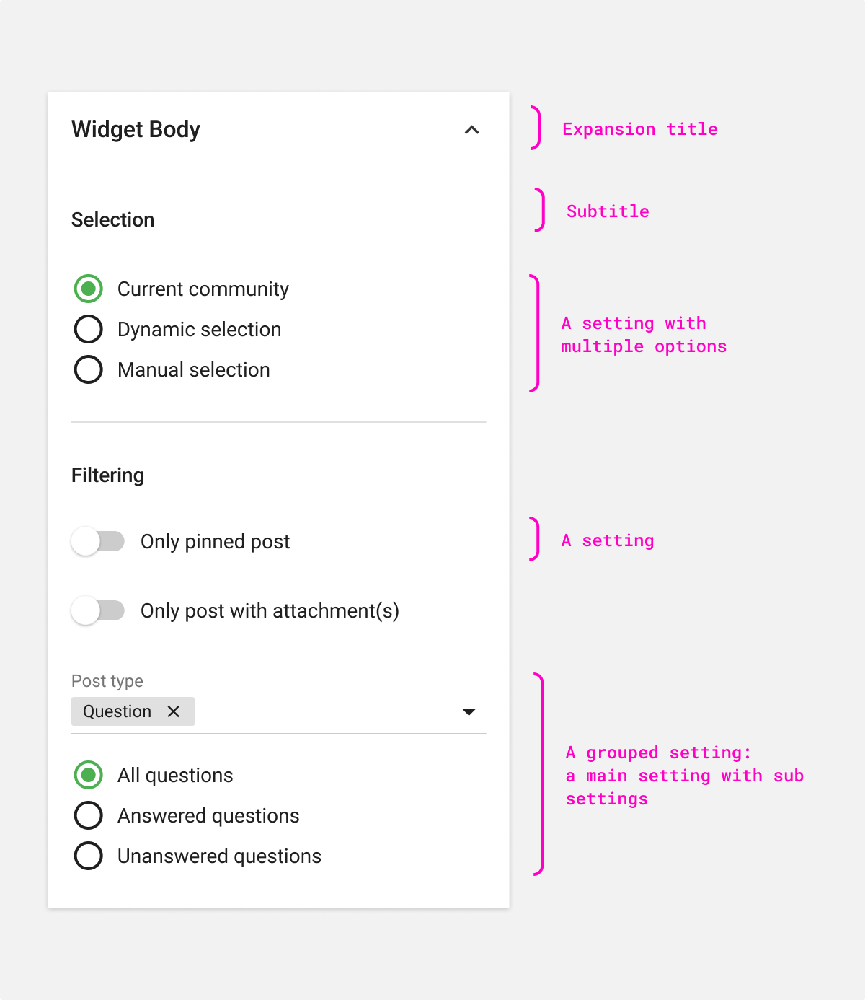

## Full view

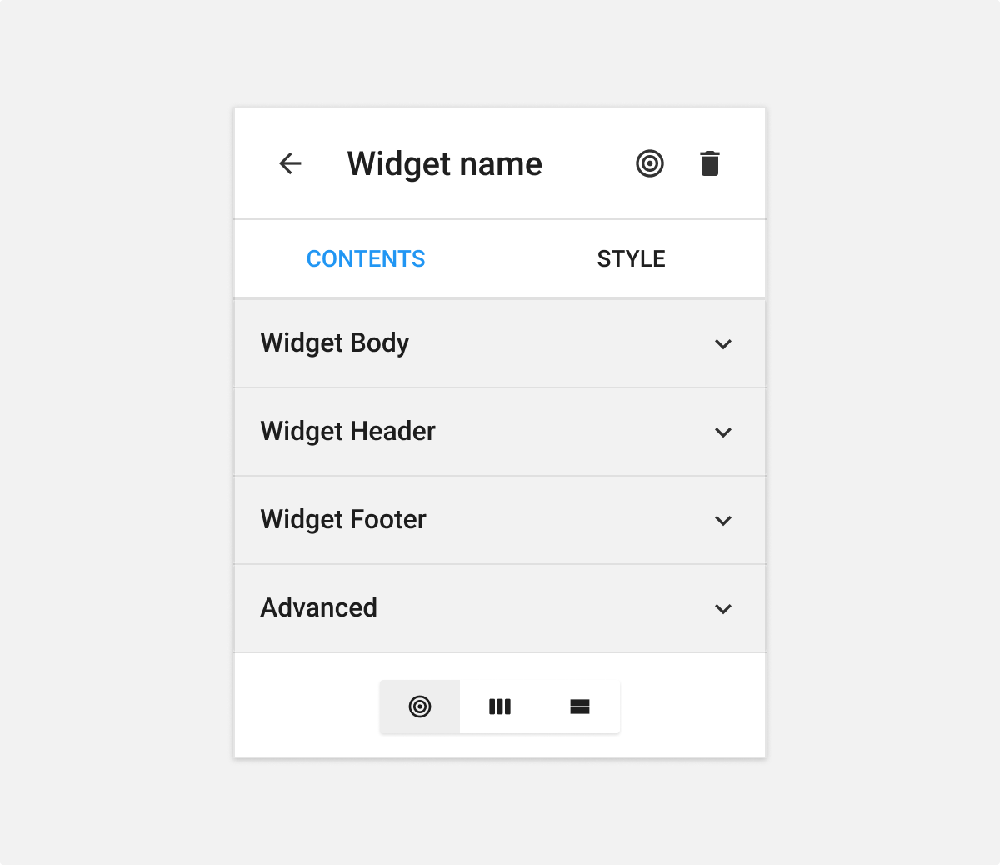

We use an expansion panel for each section.

By default, during creation, only the section Widget Body is expanded. The other are collapsed. In edition, all sections are collapsed.

Only one expansion panel can be opened at the same time. If a second expansion panel is opened, the first one is automatically closed.

Between each expansion panel, a divider is used.

## Sections

### Widget Body

This section regroups:

**Selection**
In this part, the origin of the contents displayed is selected.

**Filtering**
This part regroups all criteria that filter/restrict items displayed in the widget.

**Sorting**
This part regroups all criteria that sort the items displayed in the widget.

**Information displayed**
Manage which information of an item to show or hide.

**Properties**
Additional properties of the widget.

    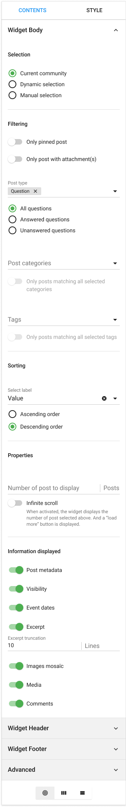

### Widget Header

The header section includes every setting that will be displayed in the header of the widget or will have an impact on this section.

    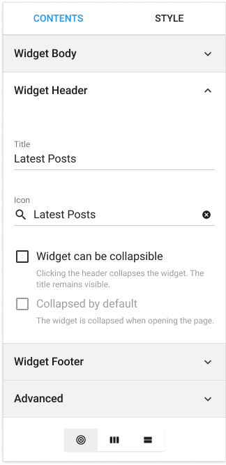

### Footer

The footer section includes every setting that will be displayed in the footer of the widget or will have an impact on this section.

    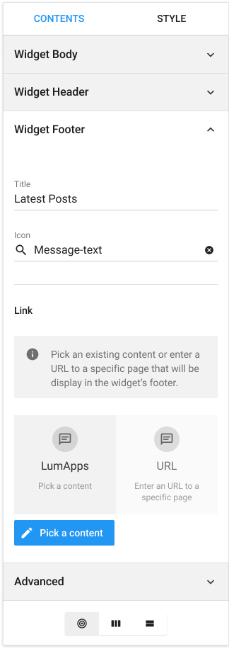

### Advanced

The advanced section includes the settings that are rarely used or which don’t fit in the other sections.

    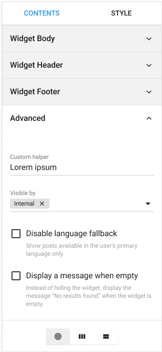

## Default behavior

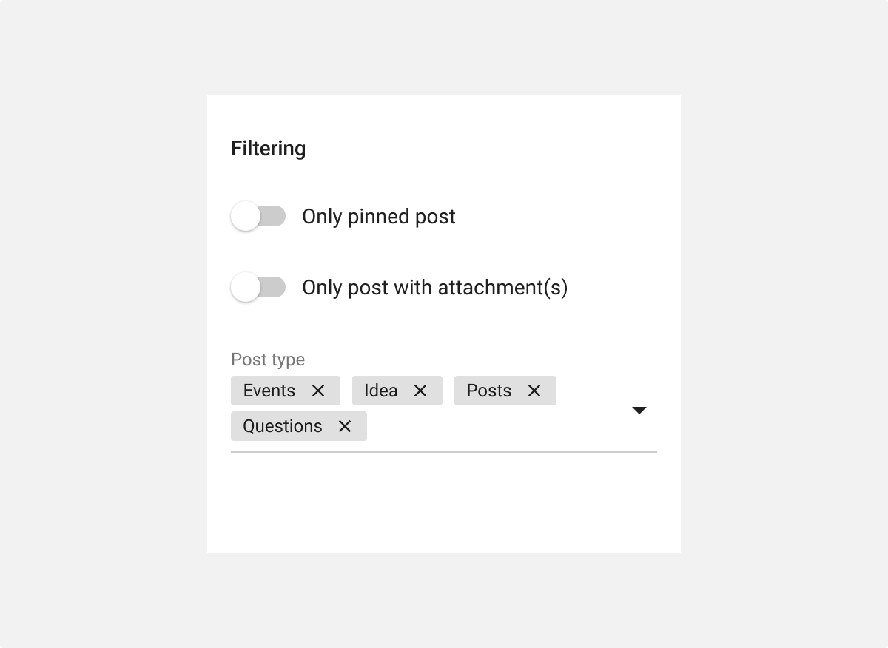

When default behavior are defined for a setting, the values are visible to the user.
_i.e. post types or excerpt truncation_

## Switches versus checkboxes

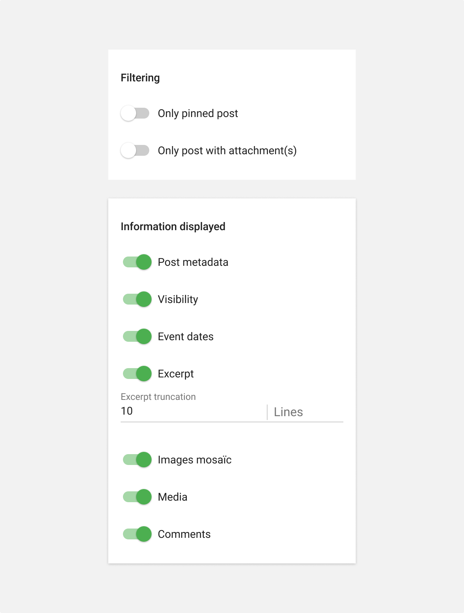

If a settings impact in real time the widget, the component used is a switch.
_i.e.information displayed in a post_

## Main and sub settings

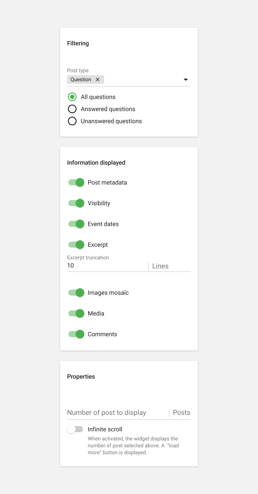

If a settings depends on the activation of another setting, the sub setting is always display close to the main setting as defined in the spacing rule.
_i.e.type of questions, infinite scroll, or excerpt truncation._
